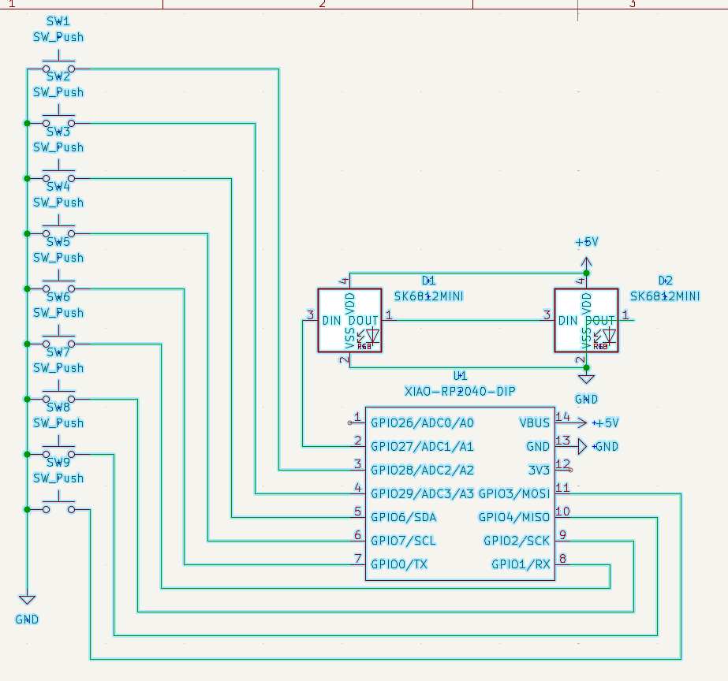

# My Keyboard Project

This repository contains the source files for my keyboard firmware. It includes `main.py` for KMK and all necessary supporting files.

---

## Screenshots

### Hackpad
.PNG)
.PNG)

### Schematic

### PCB

### Case
.PNG)
.PNG)
---

## Bill of Materials (BOM)

| Part Name           | Quantity |
|---------------------|----------|
| PCB                 | 1        |
| Cherry MX Switch    | 9        |
| Keycaps             | 9        |
| Seeed XIAO RP2040   | 1        |
| Case                | 1        |
| M3x16 Bolt          | 4        | 
| M3 Heatset          | 4        |
| SK6812 MINI LEDs    | 2        |

---

## Description

This is my 3x3 hackpad key board submission. I had a lot of fun learning how to use Kicad, Fusion, and other software while designing this. It is really simple just the base project plus extra keys and a bigger box. While working on this project I had one thing in mind and that was moving on to more complex projects.
